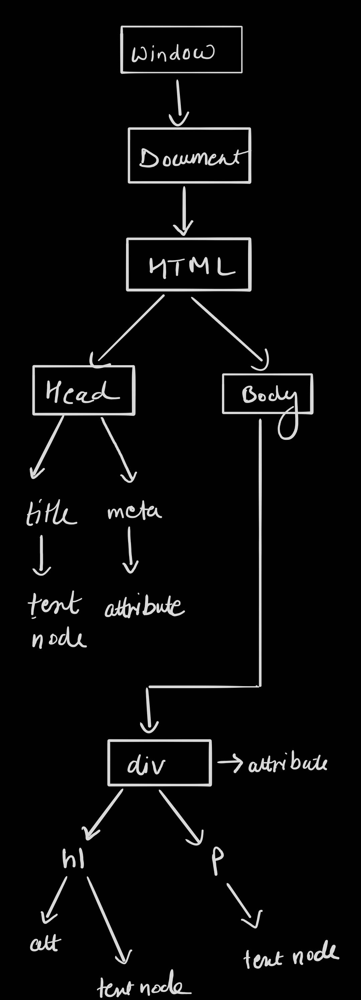
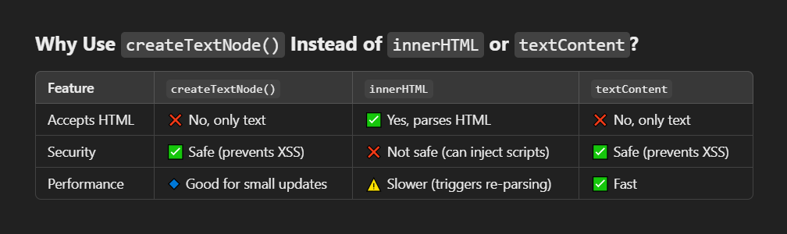

Practice projects link -https://stackblitz.com/edit/dom-project-chaiaurcode-3bugosum?file=styles.css

Every language has a software which understands the syntax structure of the language. Ex - interpreter, compiler.
For years this software for JS was inside the browsers. But now it's easily available so now we can execute JS standalone. Now JS is not just a browser/frontend language.
NodeJS is one the environments which helps us execute JS. DinoJS is also onw of them.

console.table([ele1, ele2, ele3 .....]) -> prints a table with all the provided varibales in the console 

<b>const</b> -> constant i.e cannot be changed/updated.

varibales can be declared in 2 ways - let and var

<b>var</b> is not used because it has function scope.<br> 
<u>Problems</u> -<br> 
<b>Function</b> Scope: It ignores block scope, causing unintended access.<br />
<b>Hoisting Issues</b>: It’s hoisted as undefined, leading to bugs.<br />
<b>Global Pollution</b>: It can accidentally create global variables.

<b>let</b> -> used to declare varibales. let has a block scope.

You may also declare a varibale without using let/var by just writing the name of the varible. Although possible, do not use this method as these varibles have global scope.<br />
<b>Global Pollution</b>: Variables declared this way become global, which can lead to naming conflicts and unpredictable behavior.<br />
<b>No Block Scope</b>: These variables don’t respect block scope, which can lead to bugs.<br />
<b>Silent Errors</b>: Mistakes like typo errors won't throw a clear error and might result in unintended behavior.


**Hoisting** in JavaScript is the behavior where **variable** and **function declarations** are moved to the **top of their scope** during the compile phase.  
- **`var`** is hoisted and initialized to `undefined`.  
- **`let`** and **`const`** are hoisted but remain **uninitialized** (in the **temporal dead zone**).  
- **Function declarations** are fully hoisted, meaning they can be called before their definition.

<br />
Earlier JS did not have classes, modules, arrow functions etc. If we write "use sctrict" in quotes, our code will be treated as the newer version of JS. This keeps the old code also compatible in the browsers 
<br /><br />
<br />
<b>Type Conversion to a number</b>
<br />
"33" => 33
<br />
"33abc" => NAN
<br />
null => 0
<br />
true => 1
<br />
undefined => NAN
<br />

<br />
<b>Type Conversion to a boolean</b>
<br />
"" => false
<br />
"abc" => true
<br />
null => false
<br />
undefined => false
<br />
any number other than 0 => true
<br />
0 => false
<br />
<br />

Equality check (==) and comparisons (>, <, >=, <=) work differently, comparison covert null to a number, treating it as 0

Strict Check (===) -> this also checks the data type of the values compared and would not perform conversion

We should not compare different datatypes as the results are not predictable


<b>Primitive Datatypes</b><br />
These are call by value<br />
7 types - string, number, boolean, null, undefined, symbol, bigInt
<br />
symbol is used to make any value unique

<b>Non-Primitive Datatypes</b><br />
These are call by reference<br />
Arrays, Objects, Functions


<b>Stack and Heap memory</b><br />
All primitive types use stack memory
Non-Primitive types use heap memory 


Strings have characters and indeces in a key value pair in js (not an array) <br />
"Var" <br />
0->V <br />
1->a <br />
2->r <br />


<h1> Arrays </h1>
Arrays are resizable in JS.
<br /> Arrays may contain a mix of datatypes.
<br /> Array copy operations create a shallow copy (call by reference)

arr1.unshift(0);    
//adds element at the start of the array <br /><br />
arr1.shift();       
//removes element from the start <br /><br />
const newArr = arr1.join();     
//adds all elements of the array into a string <br /><br />
arr1.map((x) => x*2)               
//The map() method of Array instances creates a new array populated with the results of calling a provided function on every element in the calling array.<br /><br />
arr1.slice(1,3) 
//slice is like substring method of strings. The slice() method of Array instances returns a shallow copy of a portion of an array into a new array object selected from start to end (end not included).<br />
Strings can also use slice but the difference is-

Negative Indexes

    slice() supports negative indexes (counts from the end).
    substring() treats negative indexes as 0.

Order of Parameters

    slice() keeps the order of parameters (start, end).
    substring() swaps the values if start > end.


arr.splice(1,3) -> <br />
//The splice() method of Array instances changes the contents of an array by removing or replacing existing elements and/or adding new elements in place
<br /><br />
const newArr = arr1.concat(arr2)<br />
//The concat method appends all elements of arr2 to arr1 and returns a new array with all the elements <b>without</b> modifying the original arrays.<br /><br />
const newArr1 = arr1.flat(3);<br />
//Returns a new array with all sub-array elements concatenated into it recursively up to the specified depth. If we don't know the depth and want to flatten the complete array, we can give Infinity as depth.
<br /><br />
Array.from()<br />
//The Array.from() static method creates a new, shallow-copied Array instance from an iterable or array-like object. It will return an empty array if it is unable to convert
<br />

<h1> Objects</h1>
Objects can be created in 2 ways - Constructor and Literals.<br />
Singleton - objects that have only a single instance. Singletons can only be creted using constructor method.<br /><br />

<b>Object literals</b>
<br />
const user = <br />
{<br />
    name : "Varun",<br />
    age : 25,<br />
    location : "Delhi",<br />
    email : "varun@gmail.com",<br />
};
<br /><br />
//keys are considered as string by the system, you dont have to explicitly mention that.<br /><br />
accessting values<br />
console.log(user.name);&nbsp; &nbsp;    //Varun<br />
console.log(user["name"]);&nbsp; &nbsp; //Varun<br />

using Symbol as a key in object<br />
const mySym = Symbol("key1");
const user = <br />
{<br />
    &nbsp; &nbsp;[mySym] : "mySymbol"<br />
};
<br /><br />
accessing Symbol <br />
console.log(user[mySym])&nbsp; &nbsp;//"mySymbol<br /><br />
We can add new key value pairs to the object like so:<br />
user.address = "Rani Bagh";<br /><br />
We can also use functions as variables<br />
user.greeting = function()<br />
{<br />
    &nbsp; &nbsp;console.log(`Hello there ${this.name}`);<br />
}<br /><br />
We can make objects immutable by using Object.freeze().<br />
Object.freeze(user);<br />
or const user = Object.freeze({ 
    ...
});<br />

<b>Combine Objects</b><br />
Objects.assign({}, obj1, obj2) -> here {} is the target and obj1 and obj2 are the sources<br />
Copy the values of all of the enumerable own properties from one or more source objects to a target object. Returns the target object.<br />

Another way of appending objects is by using spread operator(...).
Similar to Arrays, this operator spreads all elements of the objects and returns a new object.<br />
const obj4 = {...obj1, ...obj2};<br />

Object.keys(obj1) -> returns an array of keys of the object.
Object.values(obj1) -> returns an array of values of the object.
Object.entries(obj1) -> returns an array of arrays where each child array has 2 elements, first key and second its value.<br />

<B>Destructuring of Object</B><br />
const {`<key>`} = `<object>`<br />
const {instructor} = course<br />
Now we can directly use the key without needing to write object.key.<br />
const {`<key>` : `<alias>`} = `<object>`<br />
we can also give an alias to the key<br />
<h1>Functions</h1>
function name(parameter1, parameter2)
{<br />
    ....<br />
    ....<br />

}

There is a problem with parameters in functions.
Suppose we create a function which accpets to numbers but since JS is dynamically typed, user may pass a string or anything else.<br />
So we need to check the datatypes before performing any task.<br />

Suppose we are not aware of the number of arguments the function will recieve. In that case we can use the rest operator(...).
It will pack all the values in an array.<br />

function calculateCartPrice(val1, val2, ...num1)<br />
{<br />
    return num1;<br />
}

console.log(calculateCartPrice(100, 200, 300, 400, 500, 600));<br />
val1 -> 100<br />
val2 -> 200<br />
num1 -> [300, 400, 500, 600]<br />

<b>Passing objects in a function</b><br />
function printUser(userObj)<br />
{<br />
    console.log(`name : ${userObj.username}, age : ${userObj.age}`);<br />
}<br />
This code will work fine if the object contains the keys we use in the fucntion. But we must type check to avoid errors.

<h3>Scopes</h3>
const and let have block scope but var has function scope.<br />
Suppose we declare a variable var c = 300 in our file. <br />
Now we import another file which has a if block with var c = 3 .<br />
This will create unexpected behaviour in the program.<br />
===============================================<br /><br />

`this` -> refers to the current context<br />

<h5>IIFE - Immediately Invoked Function Expressions</h5>
(function connect()<br />
{<br />
&nbsp;&nbsp;&nbsp;&nbsp;console.log("DB connected");<br />
})()
<br />
// () -> first paranthesis creates a block which has the fucntion definition
//() -> second parathesis is to execute the fucntion
<br /><br />
<b>Why Use IIFE?</b><br />
<u>Avoid Global Scope Pollution:</u><br />
Variables declared inside an IIFE are scoped to the function, preventing them from polluting the global namespace.<br />
<u>Encapsulation:</u><br />
It creates a private scope using closures, keeping variables and functions hidden from external code.<br />
<u>Immediate Execution:</u><br />
Useful when you need to initialize code immediately, like setting up event listeners or creating modules.<br /><br />

**Imp** -> IIFE does not know where to stop the context. So, we need to end the context by adding a semicolon(;) at the end.

We can arrow functions as IIFE too.


Rewatch - <a href= "https://www.youtube.com/watch?v=ByhtOgF6uYM&list=PLu71SKxNbfoBuX3f4EOACle2y-tRC5Q37&index=25">How does javascript execute code + call stack | chai aur #javascript</a>


<h2>Control Flow</h2>
if(condition)<br />
{...}
<br />
operators : <, >, <=, >=, ==, !=, === (strict equals), !== (strict not equals). <br />
strict operators check data type as well
<br /><br />

**Truthy and Flasy Vaulues**<br />

Truthy values are values whicha are considered true when encountered in a Boolean context. All values are truthy unless they are defined as falsy.<br />

<u>falsy</u> - false, 0, -0, BigInt - 0n, "" (empty string), null, undefined, NAN <br />
<u>some truthy values</u> -[], {}, "0", "false", " ", function(){}<br />

**Nullish Coalescing Operator**<br />
The nullish coalescing (??) operator is a logical operator that returns its right-hand side operand when its left-hand side operand is null or undefined, and otherwise returns its left-hand side operand.<br />

forof loop for maps<br /><br />

const map = new Map();<br />
map.set(1, "a");<br />
map.set(4, "d");<br />
map.set(4, "e");<br />


for (const keyValPair of map) <br />
{<br />
 &nbsp;&nbsp;&nbsp;   console.log(keyValPair);   
}

for (const [key, value] of map)<br />
{<br />
 &nbsp;&nbsp;&nbsp;   console.log(value);   
}<br />

**Note** -forof loop cannot be used for objects

forin Loop is used for objects<br />

for (const key in langs) <br />
{<br />
   &nbsp;&nbsp;&nbsp;console.log(langs[key]);&nbsp;&nbsp;&nbsp;//displays all values<br />
}


We can use forin loop for arrays too but we'll have to extract the values from key like so `arr[key]`

**Note** -forin loop cannot be used for maps.<br />

const values = arr.filter((item) => {   return item > 4});<br />
returns an array of values from the original array which meet the condition.


Array.prototype.reduce() -> The reduce() method of Array instances executes a user-supplied "reducer" callback function on each element of the array, in order, passing in the return value from the calculation on the preceding element. The final result of running the reducer across all elements of the array is a single value.

The first time that the callback is run there is no "return value of the previous calculation". If supplied, an initial value may be used in its place. Otherwise the array element at index 0 is used as the initial value and iteration starts from the next element (index 1 instead of index 0).<br />

const nums = [1, 2, 3, 4];

let initialSum = 0;

let total = nums.reduce(function(accumulator, currentValue)
{
    console.log(accumulator, currentValue);
    return accumulator + currentValue;
}, initialSum);


<h1>Document Object Model (DOM)</h1>


<br /><p style = "text-align : center">HTML Diagram</p>

We can get HTML elements by using some functions and manipulate them.<br />

const title = document.getElementById('title');<br />
title.style.borderRadius = "10px"<br />

<ul>
<li>title.textContent -> returns all text content in the elemnt<br />
<li>title.innerText -> returns only the visible text<br /> 
(style = "display : none") -> hides element
<li>title.innerHTML -> returns all html inside the element including tags<br /> 
</ul>

<br /><br />
document.getElementsByClassName('heading')<br /><br />
The **getElementsByClassName()** method returns a collection of elements with a specified class name<br /><br /><br />


document.querySelector('h1')    //tag<br />
document.querySelector('#title')    //id<br />
document.querySelector('.heading')  //class<br /><br />
The Document method querySelector() returns the first Element within the document that matches the specified CSS selector, or group of CSS selectors. If no matches are found, null is returned.<br /><br /><br />

const tempLiList = document.querySelectorAll('li')<br />
tempLiList.forEach((item) => item.style.color = "green" ) <br />
tempLiList[0].style.color = "green"<br /><br />
The Document method querySelectorAll() returns a static (not live) NodeList representing a list of the document's elements that match the specified group of selectors.<br /><br />

getElementsByClassName return a HTML collection <br />
We can convert HTMLCollection or NodeList to an Array to use its fucntionalities <br />
Array.from(collectionName)

<h3> Parent child relationships</h3>
const parent = document.querySelector(".parent");<br /><br />
we may run a for loop on all children<br />
for (let i = 0; i < parent.children.length; i++) <br />
{<br />        
    &nbsp;&nbsp;&nbsp;console.log(parent.children[i].innerHTML);<br />
}<br />
<br />
We can access children like arrays - parent.children[0]<br />
parent.children[1].innerHTML<br /><br />

Accessing the first or the last child<br />
parent.firstElementChild<br />
parent.lastElementChild
<br /><br />
Accessing the parent from children<br />
const monday = document.querySelector('.day');<br />
monday.parentElement<br />

Accessing siblings<br />
monday.nextElementSibling<br />
monday.previousElementSibling<br /><br />

**Child Nodes of a div**<br />
parent.childNodes<br />
This doesn't just give us the divs inside the parent. But it also gives us other nodes containing information about line breaks in our code, comments etc. as browser stores all that info.

**Creating and Attaching Elements**<br />
create -> const div = document.createElement('div');<br /><br />
div.className = "main";<br /><br />
div.id = "myID";<br /><br />
div.setAttribute("title", "New Title");<br />
//It is prefered to use this method instead of directly getting and setting attributes<br /><br />
div.style.backgroundColor = "green";<br /><br />
div.style.padding = "10px";<br /><br />
// div.innerText = "Created Div"<br /><br />
const addText = document.createTextNode("Creared Text Node");<br /><br />
div.appendChild(addText);<br /><br />

We still need to attach the element to the document<br />
document.body.appendChild(div);<br />

Difference between `innerText`, `textContent` and `innerHTML`
<ul>
    <li> innerText -> Displays the visible text of an element (excluding hidden content using CSS like display: none).
    <li> textContent -> Returns or sets the entire text content of an element, including hidden text.
    <li> innerHTML -> Returns or sets the HTML inside an element as a string.
</ul>

Use innerText if you care about how the text appears to users.

Use textContent when you need plain text without HTML parsing, especially for security purposes (prevents XSS attacks).

Use innerHTML if you need to render or manipulate HTML content.<br /><br />

`append()`<br />
->Can append multiple nodes or text at once.<br />
->Supports text strings directly without creating a TextNode.<br />
->Returns nothing (undefined).

`appendChild()`<br />
->Appends only one node (an element or a TextNode).<br />
->Does not support appending plain text directly.<br />
->Returns the appended node.<br />



<br /><br />
**setInterval(function(){}, timeInMilliSeconds)** -> runs a function at a fixed interval
<br /><br />

<h3>let vs var</h3>
In JavaScript, let and var are both used to declare variables, but they have important differences:

1. Scope<br />
-> var: Function-scoped (available throughout the function where it's declared).<br />
-> let: Block-scoped (only available within the block {} where it's declared).
2. Hoisting<br />
-> var: Hoisted (moved to the top) but initialized as undefined.<br />
-> let: Hoisted but not initialized (causes a ReferenceError if accessed before declaration).
3. Re-declaration<br />
-> var: Can be re-declared in the same scope.<br />
-> let: Cannot be re-declared in the same scope.
4. Global Object Property<br />
-> var: If declared globally, it becomes a property of window (in browsers).<br />
-> let: Does not become a property of window.
<br />

<h1>Events</h1>

Here’s a **precise and structured list** of the most important JavaScript event types:  

### **1. Mouse Events**
- `click` – When an element is clicked  
- `dblclick` – When an element is double-clicked  
- `mousedown` – When a mouse button is pressed  
- `mouseup` – When a mouse button is released  
- `mousemove` – When the mouse moves  
- `mouseenter` – When the mouse enters an element (does NOT bubble)  
- `mouseleave` – When the mouse leaves an element (does NOT bubble)  
- `mouseover` – When the mouse enters an element (bubbles)  
- `mouseout` – When the mouse leaves an element (bubbles)  
- `contextmenu` – When the right mouse button is clicked  

### **2. Keyboard Events**
- `keydown` – When a key is pressed  
- `keyup` – When a key is released  

### **3. Form Events**
- `submit` – When a form is submitted  
- `reset` – When a form is reset  
- `focus` – When an element gains focus  
- `blur` – When an element loses focus  
- `change` – When an input/select/textarea value changes  
- `input` – When an input value changes (fires on every change)  

### **4. Window & Document Events**
- `load` – When the page fully loads  
- `DOMContentLoaded` – When the HTML document is fully loaded  
- `resize` – When the window is resized  
- `scroll` – When the document or an element is scrolled  
- `beforeunload` – Before the page unloads (for warnings)  

### **5. Clipboard Events**
- `copy` – When content is copied  
- `cut` – When content is cut  
- `paste` – When content is pasted  

### **6. Drag and Drop Events**
- `dragstart` – When dragging starts  
- `drag` – While dragging  
- `dragend` – When dragging ends  
- `dragover` – When an element is dragged over a drop target  
- `drop` – When an element is dropped  

### **7. Touch Events (for Mobile)**
- `touchstart` – When a touch starts  
- `touchmove` – When a touch moves  
- `touchend` – When a touch ends  

### **8. Media Events**
- `play` – When media starts playing  
- `pause` – When media is paused  
- `ended` – When media playback ends  

### **9. Network Events**
- `online` – When the browser goes online  
- `offline` – When the browser goes offline  

This is a **clean and essential** list of JavaScript event types. 🚀 Let me know if you need further details!


### **Event Arguments (`event` Object) in JavaScript**  

In JavaScript, when an event occurs, an **event object** is automatically passed to the event handler function. This object contains useful properties and methods related to the event.  

---

### **1. Common Properties of the `event` Object**
The event object has different properties depending on the event type. Here are some commonly used properties:  

#### **General Event Properties**
| Property | Description |
|----------|-------------|
| `type` | The type of event (e.g., `"click"`, `"keydown"`) |
| `target` | The element that triggered the event |
| `currentTarget` | The element that has the event listener attached |
| `bubbles` | `true` if the event bubbles up the DOM |
| `cancelable` | `true` if the event can be prevented |
| `defaultPrevented` | `true` if `event.preventDefault()` was called |
| `timeStamp` | The time when the event was created |

#### **Mouse Event Properties (`click`, `mousemove`, etc.)**
| Property | Description |
|----------|-------------|
| `clientX` / `clientY` | Mouse coordinates relative to the viewport |
| `pageX` / `pageY` | Mouse coordinates relative to the document |
| `screenX` / `screenY` | Mouse coordinates relative to the screen |
| `button` | Which mouse button was pressed (`0` = left, `1` = middle, `2` = right) |
| `buttons` | Bitmask of buttons currently pressed |
| `ctrlKey` / `shiftKey` / `altKey` / `metaKey` | `true` if the respective key was held |

#### **Keyboard Event Properties (`keydown`, `keyup`)**
| Property | Description |
|----------|-------------|
| `key` | The key pressed (e.g., `"Enter"`, `"a"`) |
| `code` | Physical key identifier (e.g., `"KeyA"`, `"Space"`) |
| `keyCode` (Deprecated) | Numeric key identifier |
| `repeat` | `true` if the key is being held down |
| `ctrlKey`, `altKey`, `shiftKey`, `metaKey` | `true` if the key was held |

#### **Form Event Properties (`input`, `change`, `submit`)**
| Property | Description |
|----------|-------------|
| `target.value` | The value of an input field |
| `target.checked` | `true` if a checkbox is checked |
| `preventDefault()` | Prevents default form submission |

#### **Clipboard Event Properties (`copy`, `paste`)**
| Property | Description |
|----------|-------------|
| `clipboardData.getData()` | Gets copied/pasted data |


---

### **2. Preventing Default Actions**
Some events have default browser behaviors, but you can prevent them using `event.preventDefault()`.  


---

### **3. Stopping Event Propagation**
If an event is bubbling up the DOM and you want to stop it, use:  

```js
event.stopPropagation();
```

---

<br />

`addEventListener()` has 3 parameters.
1 -> type of event, ex - `click`;
2 -> function to execute;
3 -> event propogation, default : false;

When we a an event attached on a parent and it's child, the 3rd parameter decides which will be triggered first.<br />
false -> Bubbling : goes from child to parent<br />
true -> capturing : goes from parent to children.<br />
We can use `e.stopPropogation()` to prevent event propogation.


<br />
<h1>Async</h1><br />

`setTimeout` -> Helps us execute a function after a set period of time.<br />This is not included in the JS engine and is provided by web APIs on browsers/runtimes.

```js
    setTimeout(() => {
        console.log("timeout")
    }, 2000)
    
    const changeText = () => document.querySelector('h1').innerHTML = "Varun";

    const timeout = setTimeout(changeText, 2000);
```

We can also stop an ongoing timeout process by using clearTimout()

```js
    const timeout = setTimeout();

    document.querySelector('#stop').addEventListener('click', () => {
        clearTimeout(timeout);
    }) 
```


`setInterval` -> This is similar to `setTimeout` the difference being that `setInterval` will keep on executing unless we stop it. To stop it we can use `clearInterval`

```js
    setInterval(() => {
        console.log("Varun" + Date.now());
    }, 1000);

    const sayDate = function()
    {
        console.log(Date.now())
    };
    setInterval(sayDate, 2000);

    const sayString = function(str)
    {
        console.log(str + Date.now())
    };

    const interval = setInterval(sayString, 2000, "hello");

```

We can also pass a paramter to the function in setInterval as seen in the last example.

<h2>API</h2>
APIs are just a way for 2 systems to communicate.
<br /><br />

You can get some random APIs from <a href = "https://api.github.com/users/VarunMakeAR">Github users</a>
or <a href = "https://randomuser.me/">Random User</a> and use <a href = "https://jsonformatter.org/">JSON Formatter</a> to format the APIs
<br /><br />

**API request using XMLHttpRequest (old way)**
<br />
<table>
<thead>
<tr>
<th>Value</th>
<th>State</th>
<th>Description</th>
</tr>
</thead>
<tbody>
<tr>
<td><code>0</code></td>
<td><code>UNSENT</code></td>
<td>Client has been created. <code>open()</code> not called yet.</td>
</tr>
<tr>
<td><code>1</code></td>
<td><code>OPENED</code></td>
<td><code>open()</code> has been called.</td>
</tr>
<tr>
<td><code>2</code></td>
<td><code>HEADERS_RECEIVED</code></td>
<td><code>send()</code> has been called, and headers and status are available.</td>
</tr>
<tr>
<td><code>3</code></td>
<td><code>LOADING</code></td>
<td>Downloading; <code>responseText</code> holds partial data.</td>
</tr>
<tr>
<td><code>4</code></td>
<td><code>DONE</code></td>
<td>The operation is complete.</td>
</tr>
</tbody>
</table>
<br />

```js
    const url = "https://api.github.com/users/Varun1911";
    const xhr = new XMLHttpRequest();
    xhr.open('GET', url);
    xhr.send();

    xhr.onreadystatechange = function(){
        console.log(xhr.readyState);
        if (xhr.readyState === 4) 
        {
            const data = JSON.parse(this.responseText);
            console.log(data.followers);
        }
    }
```

We will recieve a string in response and we need to convert it to JSON so that we can use it.

<h3>Promises</h3>
The Promise object represents the eventual completion (or failure) of an asynchronous operation and its resulting value.
<br /><br />
A Promise is in one of these states:
<ul>
    <li>pending: initial state, neither fulfilled nor rejected.
    <li>fulfilled: meaning that the operation was completed successfully.
    <li>rejected: meaning that the operation failed.
</ul>

<br />
Creating and using a promise

```js
const promiseOne = new Promise(function(resolve, reject)
{
    //Do an async task
    //Ex - DB calls, cryptography, network call

    setTimeout(() => {
        console.log("async task is complete");
        resolve();
    } , 1000)
});

//consuming promise
promiseOne.then(function()
{
    console.log("promise consumed");
});
```

`resolve()` function needs to be called. This links the promise to `then`

We can also directly call then after a promise declaration. 

```js
new Promise(function(resolve, reject){
    //_______
    resolve();
    //________
}).then(function()
{
    console.log("async 2 resolved");
});
```

We can chain then and also use catch for errors and finally which will be executed no matter if the promise is resolved or rejected.

```js
const promiseFour = new Promise(function(resolve, reject)
{
    setTimeout(() => {
        let error = true;
        if(!error)
        {
            resolve([1,2,4,66]);
        }
        else
        {
            reject("Something went wrong");
        }
    }, 1000);
});

promiseFour
    .then((data) =>
    {
        console.log(data);
        return data[1];
    }).then((data) =>
    {
        console.log(data);
    }).catch((error) =>
    {
        console.log(error);
    }).finally(() => 
    {
        console.log("task complete");
    });
```

If we reutrn some data from `then`, it is passed to the next `then` in the chain.

Consuming promise using async await
```js
async function consumePromiseFive(){
    //if resolved
    try
    {
        const response = await promiseFive;
        console.log(response);
    }

    //if rejected
    catch(e)
    {
        console.log(e);
    }
}
```

Using Async await and fetch to get data from API

**Async await**
```js
async function getAllUsers()
{
    try{
        const response = await fetch('https://jsonplaceholder.typicode.com/users');
        const data = await response.json();
        console.log(data);
    }
    catch(e){
        console.log("E : " + e);
    }
}

getAllUsers();
```
We need wait for the respose to come and we also need to wait for it to be converted to a json as that also requires time.


**fetch**
```js
fetch('https://jsonplaceholder.typicode.com/users')
.then((response) =>
{
    return response.json();
}).then((json) =>
{
    console.log(json);
}).catch((error) =>
{
    console.log(error);
})
```
We dont need to mention await here as every then is run after the previous then is completed